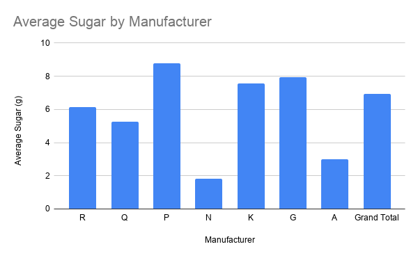
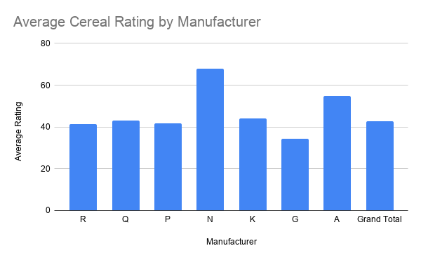
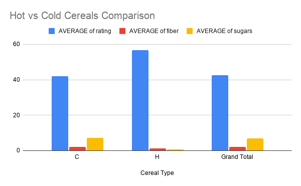

# **The Truth About Breakfast: Nutrition Report on 80 Cereals**

[google sheet](https://docs.google.com/spreadsheets/d/1MDdbW7sUO9WAM0JcKsCIjUSFUDcD7vMIK2ZApAdLR4A/edit?usp=sharing)

### Source of Data
The dataset was downloaded from Kaggle, but Kaggle is only a platform that hosts datasets rather than the original source. The data was compiled and cleaned by researchers Petra Isenberg, Pierre Dragicevic, and Yvonne Jansen from an earlier breakfast cereal nutrition dataset based on information from cereal nutrition labels. It includes data for about 80 cereals, such as calories, sugar, protein, fiber, sodium, vitamins, serving size, and manufacturer.

### Challenges with the Data
One challenge with this dataset is that the original data collection process is not fully documented. Although the nutrition information likely came from product labels, the dataset does not specify exactly when or where the information was collected, and some cereals may have changed their recipes or no longer be sold. In addition, the "rating" variable is believed to come from Consumer Reports, but the dataset does not explain how the ratings were calculated. Because of these limitations, a journalist should verify the nutritional information using current product labels or government nutrition databases before publishing conclusions. While the dataset does not appear to have a commercial or political agenda, its age and limited documentation mean it should be used carefully and not treated as a completely authoritative source.

### Analyzing the Data

To analyze the dataset, I created three pivot tables comparing cereal manufacturers by average sugar content, average consumer rating, and the difference between hot and cold cereals. I was interested in comparing manufacturers because it shows whether certain brands consistently produce healthier cereals than others. Looking at average sugar levels helped identify which manufacturers tend to make sweeter cereals, while average fiber content provided insight into which companies offer more nutritious, high-fiber options. Comparing the average ratings allowed me to see whether cereals with healthier nutritional profiles also received higher consumer ratings.

 

For my third pivot table, I compared hot and cold cereals by their average rating, fiber, and sugar content. I wanted to see whether hot cereals are generally healthier than cold cereals since hot cereals are often considered a more nutritious breakfast choice. The comparison showed noticeable differences in nutrition between the two types, particularly in fiber and sugar levels, suggesting that cereal type can have an impact on its overall nutritional value. Together, these pivot tables helped reveal patterns in the dataset and showed how both the manufacturer and the type of cereal can influence its nutritional quality.The [google sheets](https://docs.google.com/spreadsheets/d/1MDdbW7sUO9WAM0JcKsCIjUSFUDcD7vMIK2ZApAdLR4A/edit?usp=sharing) shows all my data analysis.

### Summary

This project analyzed a dataset of approximately 80 breakfast cereals using Google Sheets, with a focus on understanding nutritional differences across manufacturers and cereal types. The analysis was based on three key visualizations: average sugar by manufacturer, average rating by manufacturer, and a comparison of hot versus cold cereals across nutritional categories such as sugar, fiber, and rating.

The first chart, which compared manufacturers and average sugar content, showed clear differences between brands. Some manufacturers consistently produced cereals with higher sugar levels, while others tended to keep sugar content lower on average. This visualization made it easier to identify patterns that would not be as obvious by looking at raw data alone. However, it is important to note that sugar content alone does not determine whether a cereal is “good” or “bad,” since nutrition is multi-dimensional.

The second chart, comparing manufacturers and average rating, added another layer to the analysis. It showed how cereals from different manufacturers were rated overall, based on a scoring system included in the dataset. Interestingly, the manufacturer with the lowest sugar content was not always the highest-rated, suggesting that consumer or evaluator preferences likely consider more than just sugar, such as taste, texture, or brand expectations. This highlights that “healthiness” and “popularity or rating” are not always aligned.

The third chart compared hot and cold cereals across nutritional measures including sugar, fiber, and rating. This comparison showed noticeable differences between the two categories. Hot cereals generally tended to have different nutritional profiles than cold cereals, especially in fiber and sugar content. This helped illustrate that cereal type itself can influence nutrition, not just brand or manufacturer. However, the differences should not be overstated, since there is variation within both categories.

### Ethical Concerns

One major ethical concern with this dataset is that it could unintentionally oversimplify or misrepresent cereal brands or products. By focusing on averages, the analysis may make some manufacturers appear consistently “unhealthy” or “healthy,” even though individual products within those brands can vary widely. This could unfairly stigmatize certain companies or influence consumer perception without considering full context.

Another concern is that the dataset is somewhat dated and not fully transparent in its collection process. It is unclear exactly when all the data was gathered or whether product formulations have changed since then. This means that conclusions drawn from the dataset may not reflect current products on the market. Additionally, the rating system is not fully explained, which raises questions about how subjective judgments may have influenced the data.

There is also the ethical issue of reducing food choices to numerical scores. Nutrition is complex and influenced by personal dietary needs, cultural preferences, and access. Presenting cereals as simply “better” or “worse” based on limited metrics could oversimplify these realities.

### Additional Reporting

To make this a more complete and ethical story, additional reporting would be necessary. First, verifying the nutritional information using up-to-date sources such as government nutrition databases or current product labels would improve accuracy. Second, understanding how the rating system was created would help determine how reliable and objective that measure actually is.

It would also be important to include expert input from nutritionists to interpret whether differences in sugar or fiber are actually meaningful in a real-world dietary context. Finally, expanding the dataset to include more recent cereals and a larger sample size would help ensure that conclusions are not based on outdated or limited information.

### Conclusion

Overall, this project shows that cereal nutrition varies significantly by both manufacturer and cereal type. While the visualizations help reveal patterns in sugar content, ratings, and differences between hot and cold cereals, the findings must be interpreted carefully. Without updated data and deeper context, these results should be seen as exploratory rather than definitive conclusions about health or quality.
